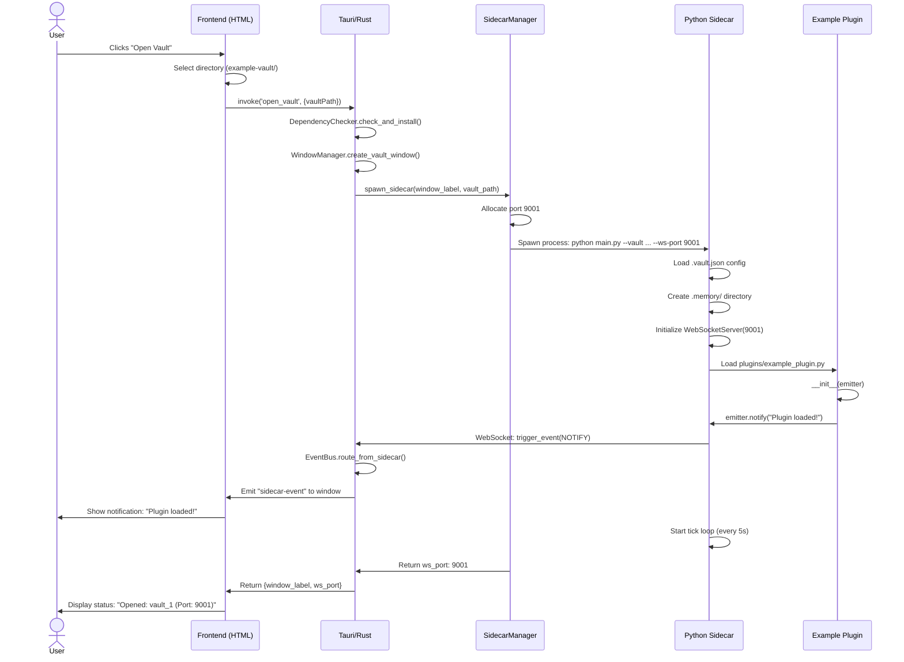
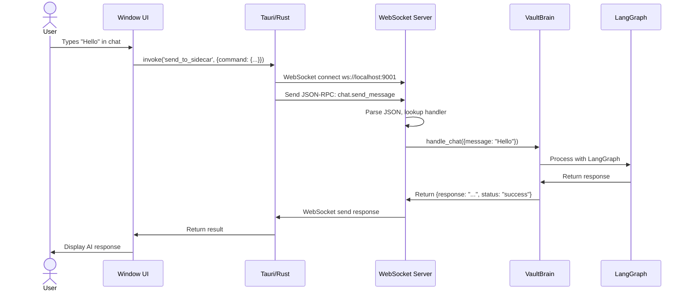
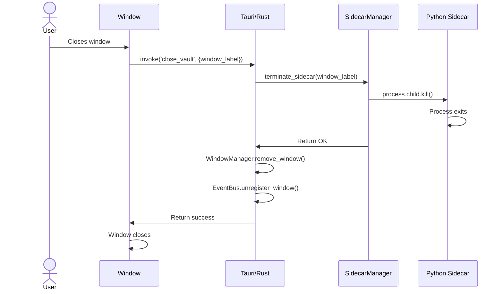
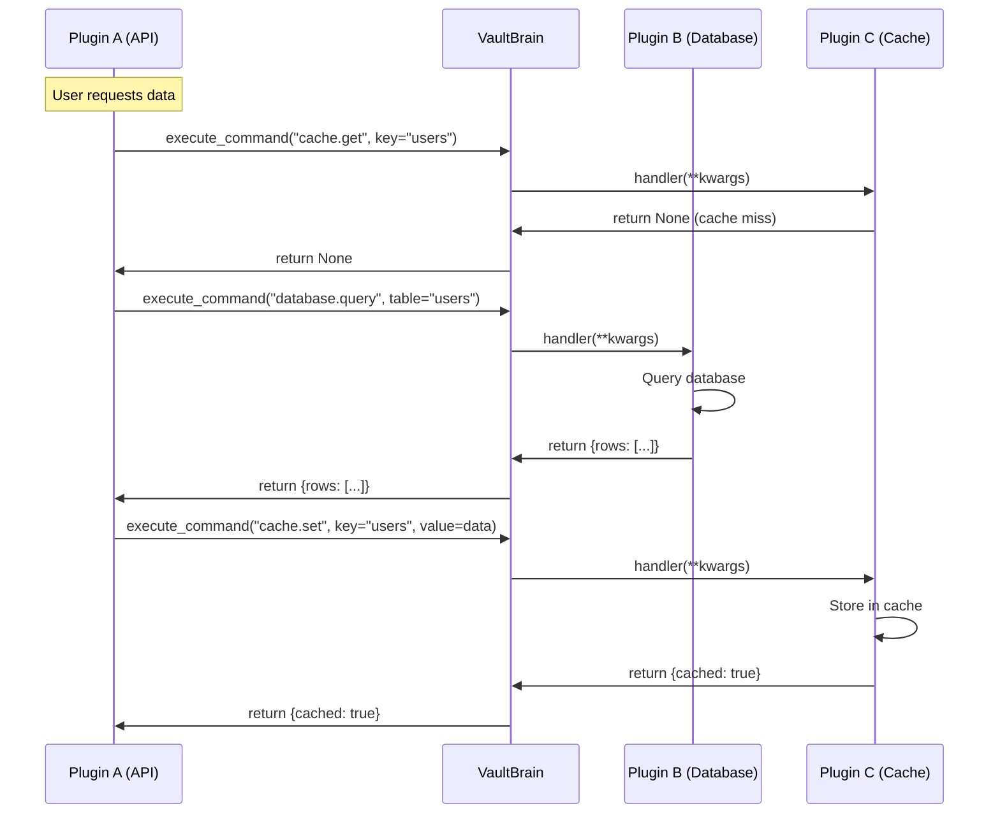

# Tailor Application - Complete Implementation Flow

## **Overview**

**Tailor** is a multi-window AI workspace framework built with **Rust/Tauri** (backend), **Python** (sidecar processes), and **WebSocket** communication. It allows users to open multiple independent "vaults" (project directories), each running isolated Python processes with custom plugins and AI capabilities.

---

## **Architecture Components**

### **1. Rust/Tauri Backend** (`src-tauri/`)

The Tauri application manages windows, processes, and event routing.

#### **Key Modules:**

- **`main.rs`**: Entry point that initializes three core managers:
  - `WindowManager`: Tracks vault windows
  - `SidecarManager`: Spawns/terminates Python processes
  - `EventBus`: Routes events between sidecars and UI

- **`sidecar_manager.rs`**: 
  - Spawns isolated Python processes for each vault
  - Allocates unique WebSocket ports (9000+)
  - Captures stdout/stderr for debugging
  - Terminates processes on window close

- **`event_bus.rs`**:
  - Routes events based on scope: `window` (single window), `vault` (all windows with same vault), `global` (all windows)
  - Maps windows to vault IDs for proper routing

- **`ipc_router.rs`**:
  - **`open_vault`**: Creates window → spawns sidecar → returns WebSocket port
  - **`send_to_sidecar`**: Communicates with Python via WebSocket (placeholder)
  - **`close_vault`**: Terminates sidecar → removes window

---

### **2. Python Sidecar** (`sidecar/`) ✨ **Refactored**

Each vault gets its own isolated Python process with professional-grade code quality.

#### **Module Organization**

```
sidecar/
├── main.py              # CLI entry point with argparse
├── websocket_server.py  # JSON-RPC 2.0 WebSocket server
├── vault_brain.py       # Plugin orchestrator
├── event_emitter.py     # Event emission API
├── constants.py         # Centralized constants & enums
├── exceptions.py        # Custom exception hierarchy
├── api/
│   ├── plugin_base.py   # Abstract PluginBase class
│   └── __init__.py
└── utils/
    ├── logging_config.py # Professional logging system
    ├── json_rpc.py       # JSON-RPC utilities
    ├── path_utils.py     # Safe path operations
    └── __init__.py
```

#### **`main.py`** (Entry Point)

**CLI Arguments:**
```bash
python main.py --vault <path> --ws-port <port> [--log-level DEBUG] [--verbose]
```

**Flow:**
1. Parses CLI arguments with `argparse`
2. Configures professional logging system (rotating file handler)
3. Validates vault path with security checks
4. Adds `vault/lib/` to `PYTHONPATH` for isolated dependencies
5. Initializes `WebSocketServer` on allocated port
6. Initializes `VaultBrain` (orchestrator)
7. Runs WebSocket server + tick loop concurrently
8. Handles errors with custom exceptions

**Type Safety:** All functions have type hints for IDE support and mypy validation.

#### **`websocket_server.py`**

**JSON-RPC 2.0 Server** for bi-directional communication:

**Features:**
- Full JSON-RPC 2.0 compliance with validation
- Type-safe command handlers with `CommandHandler` type alias
- Structured error responses with error codes
- Professional logging (no print statements)
- Automatic async handler wrapping

**Key Methods:**
- `register_handler(method: str, handler: CommandHandler) -> None`
- `send_to_rust(data: Dict[str, Any]) -> None`
- `handle_message(message: str) -> None`
- `get_registered_methods() -> List[str]`

**Uses:** `utils.json_rpc` for message building/validation, `constants` for error codes.

#### **`event_emitter.py`**

**Plugin API** for emitting events to the UI:

**Features:**
- Type-safe with enums (`EventType`, `EventScope`, `Severity`)
- Input validation for scope and severity
- Logging all event emissions
- JSON-RPC message building

```python
from constants import EventType, EventScope, Severity

emitter.notify("Task complete!", severity=Severity.SUCCESS)  # Type-safe
emitter.progress(75, "Processing...")                        # Progress bar
emitter.update_state("key", value)                           # UI state
emitter.emit(EventType.CUSTOM, {...}, scope=EventScope.GLOBAL)
```

#### **`vault_brain.py`**

**Plugin Orchestrator** that manages vault-specific operations:

**Features:**
- Type-safe plugin loading with validation
- Command registry with async handler verification
- Per-plugin logger setup
- Safe path operations (prevents directory traversal)
- Structured error handling

**Initialization:**
1. Validates vault path with `utils.path_utils`
2. Loads and validates `.vault.json` config
3. Creates `.memory/` directory safely
4. Discovers plugins using `discover_plugins()`
5. Validates plugin structure (main.py exists)
6. Loads plugins with isolated error handling
7. Builds LangGraph instance (placeholder)
8. Registers command handlers with WebSocket server

**Plugin Loading:**
- Scans `vault/plugins/*/main.py` (directory-based plugins)
- Validates plugin structure before loading
- Dynamically imports each module
- Finds `Plugin` class → validates it's async-compatible
- Instantiates with `EventEmitter`, `VaultBrain`, `plugin_dir`, `vault_path`
- Uses `get_plugin_logger()` for plugin-specific logging

**Command Registry:**
- Validates handlers are async functions
- Provides `execute_command()` with error handling
- Returns available commands via `get_commands()`

**Tick Loop:**
- Runs every 5 seconds (configurable via `DEFAULT_TICK_INTERVAL`)
- Calls `on_tick()` for plugins that implement it
- Isolates errors (one plugin failure doesn't crash others)
- Calls `plugin.on_tick(emitter)` for each plugin
- Allows plugins to emit periodic events

**Command Handlers:**
- `chat.send_message`: Processes chat (placeholder echoes back)
- `execute_command`: Calls plugin methods dynamically (e.g., `example_plugin.custom_action`)

---

### **3. Plugin System** \u2728 **Standardized**

Plugins use a **command registry pattern** similar to VSCode and Obsidian, where they register commands that can be executed by anyone (UI, other plugins, keyboard shortcuts, etc.).

#### **PluginBase Abstract Class** (`sidecar/api/plugin_base.py`)

All plugins now inherit from `PluginBase`, which provides:

**Automatic Setup:**
- Plugin name from directory
- Logger configuration (`self.logger`)
- State tracking (`self.is_loaded`)

**Lifecycle Hooks:**
- `__init__()` - Plugin instantiation
- `register_commands()` - Required: Register plugin commands
- `async on_load()` - Optional: Called after all plugins loaded
- `async on_tick(emitter)` - Optional: Called every 5 seconds
- `async on_unload()` - Optional: Cleanup before shutdown

**Helper Methods:**
- `load_settings(filename="settings.json")` - Load plugin config
- `save_settings(settings, filename="settings.json")` - Save plugin config
- `get_config_path(filename)` - Get path to config file

#### **Plugin Structure** (`vault/plugins/my_plugin/`)

```
my_plugin/
\u251c\u2500\u2500 main.py          # Required: Plugin class inheriting from PluginBase
\u251c\u2500\u2500 settings.json    # Optional: Plugin configuration
\u2514\u2500\u2500 README.md        # Optional: Documentation
```

#### **Example Plugin** (`example-vault/plugins/demo_plugin/main.py`)

```python
import sys
from pathlib import Path
from typing import Dict, Any

# Add sidecar to path
sidecar_path = Path(__file__).parent.parent.parent.parent / "sidecar"
sys.path.insert(0, str(sidecar_path))

from api.plugin_base import PluginBase

class Plugin(PluginBase):
    """Demo plugin showing PluginBase usage."""
    
    def __init__(self, emitter, brain, plugin_dir, vault_path):
        """Initialize plugin - automatic logging setup."""
        super().__init__(emitter, brain, plugin_dir, vault_path)
        
        # Load settings
        settings = self.load_settings()  # Helper method
        self.my_setting = settings.get("key", "default")
        
        # Register commands
        self.register_commands()
        
        self.logger.info("Plugin initialized")  # Automatic logger
    
    def register_commands(self) -> None:
        """Register plugin commands - REQUIRED."""
        self.brain.register_command(
            "demo.hello",
            self.handle_hello,
            self.name  # Automatic plugin name
        )
    
    async def handle_hello(self, name: str = "World", **kwargs) -> Dict[str, Any]:
        """Command handler with type hints."""
        message = f"Hello, {name}!"
        self.emitter.notify(message, severity="success")
        return {"status": "ok", "message": message}
    
    async def on_load(self) -> None:
        """Called after all plugins loaded."""
        await super().on_load()
        self.emitter.notify("Demo plugin loaded!", severity="success")
    
    async def on_tick(self, emitter) -> None:
        """Called every 5 seconds - optional."""
        self.logger.debug("Tick from demo plugin")
```

**See [PLUGIN_GUIDE.md](file:///C:/Users/ARC/Dev/tailor/PLUGIN_GUIDE.md) for complete documentation.**

#### **Plugin Development Best Practices**

1. **Always inherit from PluginBase**
2. **Use type hints** for all functions
3. **Use `self.logger`** instead of `print()`
4. **Validate input** in command handlers
5. **Handle errors gracefully** with try-except
6. **Use `load_settings()`** for configuration

#### **Command Registry API**

**Register Command:**
```python
brain.register_command(command_id, handler, plugin_name)
# Example: brain.register_command("database.query", self.query, "database")
```

**Execute Command** (from any plugin):
```python
result = await self.brain.execute_command("database.query", table="users")
```

**List Commands:**
```python
commands = brain.get_commands()
# Returns: {"example.customAction": {"plugin": "example_plugin"}, ...}
```

**Plugin Lifecycle:**
1. **Load**: `VaultBrain._load_plugins()` imports module
2. **Init**: `Plugin(emitter, brain)` constructor called, commands registered
3. **Tick**: `on_tick()` called every 5s by tick loop
4. **Commands**: Executed via `brain.execute_command(command_id, **args)`

---

### **4. Frontend** (`index.html`)

Simple launcher UI:

```javascript
// User clicks "Open Vault" → selects directory
const result = await invoke('open_vault', { vaultPath: selected });
// Returns: { window_label: "vault_1", ws_port: 9001 }
```

**New Window Created:**
- Separate Tauri window for each vault
- Connects to WebSocket at `ws://localhost:{ws_port}`
- Listens for events via `sidecar-event` channel

---

## **Complete Flow Examples**

### **Flow 1: User Opens a Vault**



**Step-by-Step:**

1. **User clicks "Open Vault"** → selects `example-vault/`
2. **Rust**: `ipc_router::open_vault()` called
3. **Dependency Check**: Installs `plugins/requirements.txt` to `lib/`
4. **Window Creation**: `WindowManager` creates new window `vault_1`
5. **Sidecar Spawn**: 
   - `SidecarManager` allocates port `9001`
   - Spawns: `python -m sidecar --vault example-vault --ws-port 9001`
6. **Python Sidecar Starts**:
   - Loads config from `.vault.json`
   - Creates `.memory/` directory
   - Loads `plugins/example_plugin.py`
   - Starts WebSocket server on port `9001`
   - Starts tick loop
7. **Plugin Initialization**:
   - `example_plugin.Plugin(emitter)` constructor runs
   - Emits: `emitter.notify("Plugin loaded!", severity="success")`
8. **WebSocket** → **Rust EventBus** → **Window UI** shows notification

---

### **Flow 2: Plugin Emits Event Every 15 Seconds**

```mermaid
sequenceDiagram
    participant Loop as Tick Loop
    participant Plugin as Example Plugin
    participant Emitter as EventEmitter
    participant WS as WebSocket Server
    participant Rust as Tauri/Rust
    participant UI as Window UI
    
    Loop->>Loop: Sleep 5 seconds
    Loop->>Plugin: on_tick(emitter)
    Plugin->>Plugin: Check tick_count % 3 == 0
    Plugin->>Emitter: notify("Heartbeat #5", severity="info")
    Emitter->>Emitter: Build JSON-RPC message
    Emitter->>WS: send_to_rust({method: "trigger_event", ...})
    WS->>Rust: WebSocket send JSON
    Rust->>Rust: EventBus.route_from_sidecar()
    Rust->>Rust: Match scope: "window"
    Rust->>UI: window.emit("sidecar-event", event)
    UI->>UI: Show notification toast
```

**Step-by-Step:**

1. **Tick Loop** (every 5s): Calls `example_plugin.on_tick(emitter)`
2. **Every 3rd tick** (15s):
   ```python
   emitter.notify("Heartbeat #5 from example_plugin", severity="info")
   ```
3. **EventEmitter** sends JSON-RPC:
   ```json
   {
     "jsonrpc": "2.0",
     "method": "trigger_event",
     "params": {
       "event_type": "NOTIFY",
       "scope": "window",
       "data": {"message": "Heartbeat #5", "severity": "info"}
     }
   }
   ```
4. **WebSocket** → **Rust**: Receives event
5. **EventBus**: Routes to `vault_1` window (scope: `window`)
6. **UI**: Shows notification toast

---

### **Flow 3: User Sends Chat Message** (Future Implementation)



**Step-by-Step:**

1. **UI**: User types "Hello" → calls `invoke('send_to_sidecar', {...})`
2. **WebSocket Server**: Receives `chat.send` command
3. **VaultBrain**: 
   - Starts `DefaultPipeline` (or GraphPipeline)
   - Calls `LLMService` to generate response
4. **Streaming**:
   - Emits `chat:stream_start`
   - Emits `chat:token` for each token
   - Emits `chat:stream_end` when done
5. **UI**: Updates chat window in real-time
6. **Memory**: `Memory` plugin listens for output and saves to disk

---

### **Flow 4: User Closes Vault**



**Step-by-Step:**

1. **Window Close Event** → `ipc_router::close_vault(vault_1)`
2. **SidecarManager**: `process.child.kill()` terminates Python
3. **WindowManager**: Removes window tracking
4. **EventBus**: Unregisters window from vault mapping

---

### **Flow 5: Plugin-to-Plugin Communication**



**Step-by-Step:**

1. **Plugin A** (API plugin) receives request for user data
2. **Check cache**: Calls `brain.execute_command("cache.get", key="users")`
3. **Cache miss**: Plugin C returns `None`
4. **Query database**: Calls `brain.execute_command("database.query", table="users")`
5. **Plugin B** queries database and returns data
6. **Store in cache**: Calls `brain.execute_command("cache.set", key="users", value=data)`
7. **Plugin C** caches the data
8. **Plugin A** returns data to user

**Benefits:**
- Plugins don't need direct references to each other
- Commands can be called even if plugin isn't loaded yet
- Easy to test (mock the command registry)
- Discoverable via `brain.get_commands()`

---

## **Event Routing Scopes**

The EventBus supports three routing scopes:

### **1. Window Scope** (Default)
```python
emitter.notify("Task complete!")  # scope="window"
```
- Routes to **only** the window that spawned this sidecar
- Most common for plugin notifications

### **2. Vault Scope**
```python
emitter.vault_event("STATE_CHANGED", {...})
```
- Routes to **all windows** that have the same vault open
- Useful for synchronized state across multiple windows

### **3. Global Scope**
```python
emitter.global_event("SYSTEM_ALERT", {...})
```
- Routes to **every window** in the application
- Useful for system-wide notifications

---

### **Data Flow: JSON-RPC Communication**

### **Command (Rust → Python)**
```json
{
  "jsonrpc": "2.0",
  "method": "chat.send",  
  "params": {
    "message": "Hello, world!",
    "stream": true,
    "chat_id": "chat_123"
  },
  "id": "cmd_123"
}
```

### **Stream Event (Python → Rust → UI)**
```json
{
  "jsonrpc": "2.0",
  "method": "trigger_event",
  "params": {
    "event_type": "chat:token",
    "scope": "window",
    "data": {
      "stream_id": "stream_abc",
      "token": "Hello",
      "accumulated": "Hello"
    }
  }
}
```

---

## **Key Design Patterns**

1. **Process Isolation**: Each vault = separate Python process (no shared state)
2. **Portable Vaults**: `vault/` folder is self-contained (plugins + deps + memory)
3. **Bi-Directional Events**: Plugins can push events to UI (not just request/response)
4. **Scoped Routing**:
   - `window`: Single window only
   - `vault`: All windows with same vault
   - `global`: Every window in the app
5. **Dynamic Plugin Loading**: Drop `.py` files in `plugins/` → auto-loaded
6. **Async Tick System**: Plugins run periodic tasks without blocking WebSocket

---

## **File Structure**

```
tailor/
├── src-tauri/                    # Rust backend
│   ├── src/
│   │   ├── main.rs               # Entry point (AppState init)
│   │   ├── window_manager.rs    # Window lifecycle management
│   │   ├── sidecar_manager.rs   # Python process orchestration
│   │   ├── event_bus.rs          # Event routing (window/vault/global)
│   │   ├── ipc_router.rs         # IPC commands (open/close/send)
│   │   └── dependency_checker.rs # Auto install dependencies
│   └── Cargo.toml
├── sidecar/                      # Python sidecar
│   ├── main.py                   # Entry point (CLI args parser)
│   ├── websocket_server.py       # JSON-RPC WebSocket server
│   ├── event_emitter.py          # Plugin API for events
│   ├── vault_brain.py            # LangGraph orchestrator
│   └── requirements.txt
├── example-vault/                # Example vault
│   ├── .vault.json               # Vault metadata
│   ├── plugins/
│   │   ├── example_plugin.py     # Demo plugin
│   │   └── requirements.txt      # Plugin dependencies
│   ├── lib/                      # Auto-managed dependencies (gitignored)
│   └── .memory/                  # Conversation history (gitignored)
├── index.html                    # Frontend launcher
└── README.md
```

---

## **Current State vs. Future**

### **✅ Implemented:**
- Multi-window vault management
- Isolated Python sidecars per vault
- WebSocket JSON-RPC communication
- **LLM Integration**: `LLMService` supporting local (Ollama) and cloud models
- **Streaming Pipeline**: Real-time token streaming to frontend
- **Memory System**: `Memory` plugin with file-based persistence
- **Plugin System**: Directory-based plugins with full lifecycle
- **Command Registry**: VSCode-style command pattern

### **🚧 In Progress:**
- **LangGraph Enhancements**: Moving from dict-based graph to full LangGraph
- **Advanced UI**: React/Vue migration for complex interfaces
- **Plugin Marketplace**: Discovery system
- **Hot Reload**: Reload plugins without restarting sidecar

---

## **Development Workflow**

### **Running the Application**
```powershell
pixi run dev
```

This will:
1. Start Vite dev server for frontend
2. Compile Rust backend
3. Launch Tauri application

### **Testing a Plugin**
1. Create `my-vault/.vault.json`
2. Add `my-vault/plugins/my_plugin.py`
3. Open vault in Tailor
4. Watch console for sidecar logs
5. Observe `on_tick` notifications every 5 seconds

### **Creating a New Plugin**
```python
# my-vault/plugins/my_plugin.py
class Plugin:
    def __init__(self, emitter):
        self.emitter = emitter
        self.name = "my_plugin"
    
    async def on_tick(self, emitter):
        """Called every 5 seconds"""
        pass
    
    async def custom_method(self, **kwargs):
        """Call via: execute_command("my_plugin.custom_method", {...})"""
        return {"status": "ok"}
```

---

## **Technology Stack**

- **Frontend**: HTML + Vanilla JavaScript + Tauri API
- **Backend**: Rust + Tauri Framework
- **Sidecar**: Python 3.10+ (asyncio)
- **Communication**: WebSocket (JSON-RPC 2.0)
- **Process Management**: Rust `std::process::Command`
- **Event System**: Tauri event emitter + custom EventBus
- **Future**: LangGraph for AI orchestration

---

## **Security & Isolation**

1. **Process Isolation**: Each vault runs in separate Python process
2. **Port Allocation**: Unique WebSocket port per vault (9000+)
3. **Dependency Isolation**: Each vault has its own `lib/` directory
4. **No Shared State**: Vaults cannot interfere with each other
5. **Local-Only**: WebSocket listens on `localhost` only

---

## **Troubleshooting**

### **Sidecar Not Starting**
- Check Python is in PATH: `python --version`
- Check sidecar logs in Rust console
- Verify `sidecar/requirements.txt` installed

### **Plugin Not Loading**
- Ensure plugin has `class Plugin` with `__init__(self, emitter)`
- Check sidecar console for import errors
- Verify plugin file doesn't start with `_`

### **Events Not Reaching UI**
- Verify WebSocket connection established (check port)
- Check EventBus routing scope matches expectation
- Inspect browser console for `sidecar-event` listener

---

## **Next Steps for Development**

1. **Implement LangGraph**: Replace placeholder with actual LangGraph orchestration
2. **Memory System**: Implement conversation history persistence
3. **Rust WebSocket Client**: Complete `send_to_sidecar` functionality
4. **Vault Window UI**: Build React/Vue UI for each vault window (chat, tools, etc.)
5. **Plugin Marketplace**: Sharing and discovering community plugins
6. **Hot Reload**: Reload plugins without restarting sidecar
