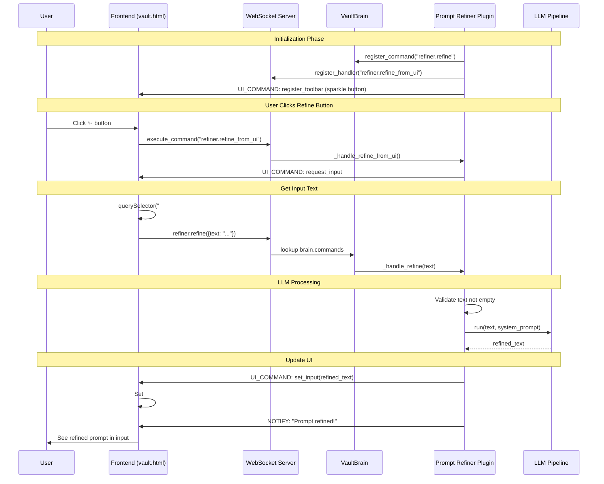
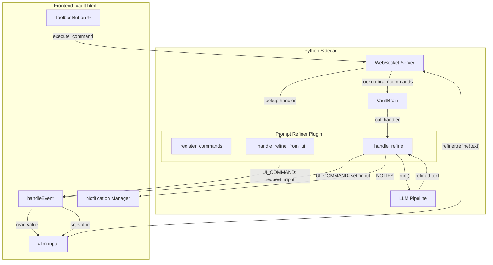
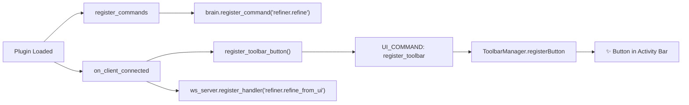
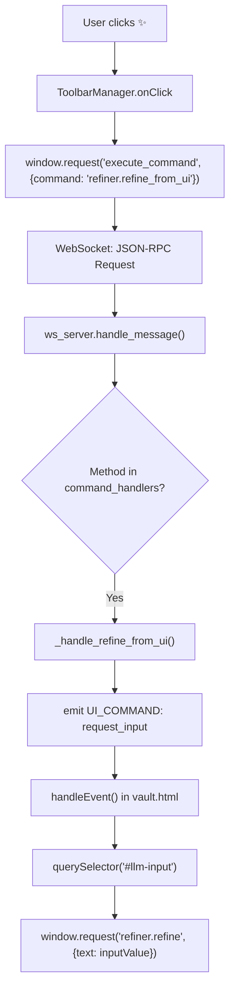
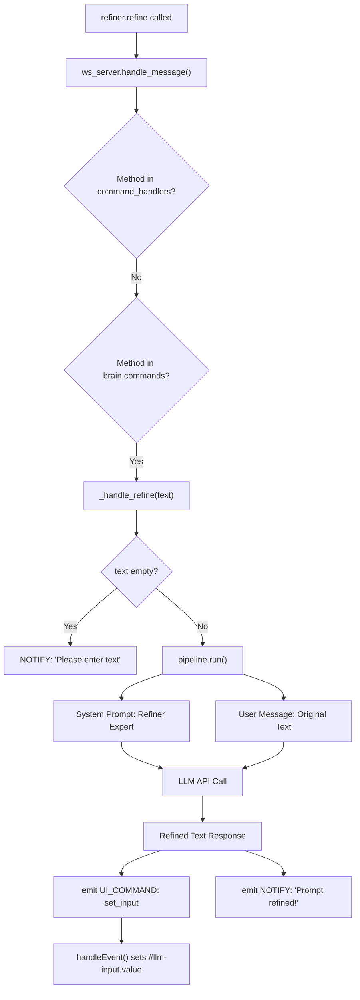

# Prompt Refiner Plugin - Architecture

## Overview

The Prompt Refiner plugin demonstrates the complete plugin communication flow in Tailor, showing how plugins interact with both the Python backend and the frontend UI.

## High-Level Flow



## Component Architecture



## Detailed Process Flow

### Phase 1: Plugin Initialization



### Phase 2: Button Click → Get Input



### Phase 3: Refine Processing



## Key Files

| File | Purpose |
|------|---------|
| [`main.py`](file:///d:/tailor/example-vault/plugins/prompt-refiner/main.py) | Plugin logic, LLM refinement |
| [`vault_brain.py`](file:///d:/tailor/sidecar/vault_brain.py) | Command registry, bidirectional lookup |
| [`websocket_server.py`](file:///d:/tailor/sidecar/websocket_server.py) | WebSocket RPC, fallback to brain commands |
| [`vault.html`](file:///d:/tailor/vault.html) | UI command handlers, input field control |
| [`plugin_base.py`](file:///d:/tailor/sidecar/api/plugin_base.py) | Base class with UI helper methods |

## Command Registration

```
┌─────────────────────────────────────────────────────────────┐
│                    Command Lookup Order                      │
├─────────────────────────────────────────────────────────────┤
│                                                              │
│  WebSocket Server receives method                            │
│          │                                                   │
│          ▼                                                   │
│  ┌───────────────────┐                                       │
│  │ ws_server.        │  ◄─── Plugins can register here       │
│  │ command_handlers  │       via ws_server.register_handler()│
│  └─────────┬─────────┘                                       │
│            │ Not found?                                      │
│            ▼                                                 │
│  ┌───────────────────┐                                       │
│  │ brain.commands    │  ◄─── Plugins register here           │
│  │                   │       via brain.register_command()    │
│  └─────────┬─────────┘                                       │
│            │ Not found?                                      │
│            ▼                                                 │
│  ┌───────────────────┐                                       │
│  │ Method Not Found  │                                       │
│  │ Error Response    │                                       │
│  └───────────────────┘                                       │
│                                                              │
└─────────────────────────────────────────────────────────────┘
```

## LLM System Prompt

The refiner uses a specialized system prompt:

```
You are a prompt engineering expert. Your job is to take a user's 
rough prompt and refine it to be:

1. **Clear**: Remove ambiguity and be specific
2. **Concise**: Remove unnecessary words
3. **Structured**: Add structure if complex
4. **Complete**: Add missing context

Rules:
- Return ONLY the refined prompt, no explanations
- Preserve the original intent completely
- Keep the same language/tone
```
